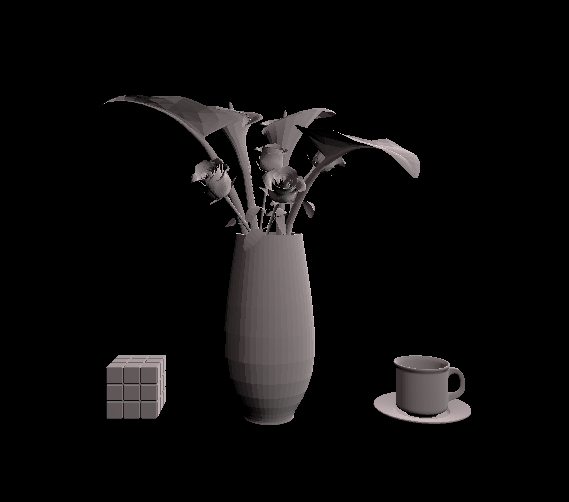

# CMPM163Labs

Lab 2 Video: https://drive.google.com/file/d/176isAq8VgUBeeHbjlNLlYNKg6hYGG6DS/view?usp=sharing

Lab 3 Video: https://drive.google.com/file/d/1tHqgdTgH8mQt6PhxtHRgjFxgl-9zJmkH/view?usp=sharing

The first cube has a "Normal" material, which appears to be a maxed out color on each side of RGB.  This means that it doesn't take a color as an input, but I did set "flatShading" to true.  It doesn't appear to change the box much though.
The second cube is the basic Phong model that was given in Part1 of this lab.  I left it unchanged.
The third cube is the example rendering cube.  I also left it unchanged.
The fourth cube is the rendered cube with the same vertexShader as the third, but with a different framentShader.  The only difference is that I changed the "vUv" to have a ".x" ending, which changed the side that the shader starts from. Then, during the html loading, I changed the colors to pink and lighter pink.

Lab 4 Video: https://drive.google.com/file/d/1-dAu9BOkkr7nu4BSDN_J2Gj70S4-8HRr/view?usp=sharing

My first three cubes are all slightly angled to show how the lighting moves in more detail.
Cube 1 is the leftmost one in the top row.  It uses the built in THREE.js textures, loading a jpg without a normMap. This leaves it flat on all sides 
Cube 2 is the middle one in the top row.  This has the addition of the normMap, which is highlighted through the lighting moving side to side. 
Cube 3 is the right one in the top row.  It has a different norm map than its image.  All of these have the norm map and image placed in a Phong material before being placed onto the cube through a THREE Mesh. 
Cube 4 is the cube on the right in the bottom row.  It doesn't use the THREE.js shaders, instead using the fragment and vertex shaders loaded in the shaders folder.  These are loaded in the script and then added to create a basic THREE.js mesh.  It doesn't need the Phong mesh like the other cubes because of the shaders that are added to the material beforehand. 
Cube 5 uses the same process as 4 of using our own shaders to create a material that is added to the cube geometry to make a mesh.  However, the shaders are slightly changed to achieve the tiling effect.  Here, I used the "mod" function on the vUv vector in the fragment shader with a float of 1.0, and multipled the vUv vector in the vertex shader by 2.0.  The vertex shader change compresses the texture because each pixel is reading twice as far as it should, which is why when the fragment shader is not enabled it appears to be stretched over the cube.  The fragment shader, when enabled with the mod 1.0, makes it so instead of stretching the last color over the rest of the cube because of an out of bounds read, reads the original image a second time because the modulo returns a number that is again in bounds of the original image. 
Question 24 answers: 
A) x = 8 * u 
B) y = -8v + 8 
C) blue 

Lab 5: https://drive.google.com/file/d/14h9_NmOHkwZoPa7grE9mUKvLv8vpf34j/view?usp=sharing  
For my cart game, I changed the body of the kart into a more metallic color, by increasing both the "metallic" and "smoothness" values.  My particles come from both wheels, aimed in a low, behind the wheel position instead of the high arch from side in the example. Next, I changed the ramp material to be a transparent amber color through the "UI/Lit/Transparent" shader with a red tint, because the setting sun gives off a red color as well. My major edit was adding coins to collect instead of the checkpoints. I inported a new mesh, with the coin model from https://www.cgtrader.com/items/834842/download-page.  There are 10 in all, and must be collected to beat the level. They also rotate, and use the coin's mesh as a collision model.  Then I used the extra track on the side to expand the track, using the inclined turns and copying the old pieces.   

Lab 6: 
  
My main scene has 3 boxes in it: a large one that has the material for part 3, and the two smaller ones with different textures for part 4.  
Spotlight: The spotlight behaves like a stage spotlight, with an angle that it shoots a light with an intensity out of it.  It can have its cone of light changed through the "spot angle", and needs to have its position set appropriately.  Mine is directly above the largest cube, and it looks like a play spot light.  
Directional light: Instead of shooting out light from a point, this light's position has no effect on its lighting.  Only the rotation is relevant, and it lights the entire scene equally from that direction. My spotlight goes from left to right on the scene.  
Point light: This light is a single point of light that shines in all directions equally, in a sphere around the light's position.  Mine is just above the right block, with a turquoise hue to stand out.  
Area light: This creates a plane of light that only shines in one direction.  The plane can be adjusted in size, rotation, and brightness.  However, it only works with baked lighting, unlike all of the others.  My area light is directly in front of the camera, giving a soft purple glow to the blocks.  
Material:  I chose a wooden fence as my material.  To make the Unity material, I created a new material set to have Opaque rendering using the Albedo Alpha source.  Next, I cropped a square out of my picture for the Albedo map, giving it a brownish color as well.  Finally, I automatically created a normal map using GIMP, and added that to the material.  

The other two materials are the same ones from the eariler box projects.  I reused them because this is more about showing that I can bring textures in, and they already look good and come with a normal map.  The left is the pebbles, the right is the one everyone used for the 2x2 shading. 
For my skybox, I downloaded a set of 6 images, created a cubemap to put them in, then made a new material as a cubemap skybox to loaded that cubemap into, then set that as my skybox in the Lighting control panel. 
